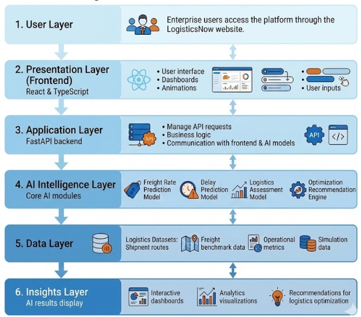
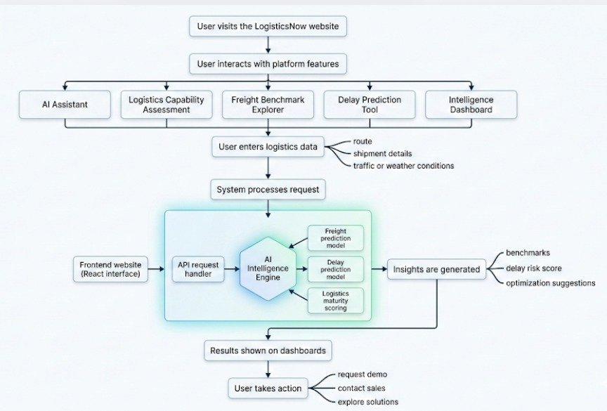

# Team Aplha Hackers

Presentation Deck : **https://docs.google.com/document/d/1EVDrwjegX6Zfc295PtlIuOxEcFZwq-slpkXxUZ0Zyv4/edit?usp=sharing**


🌐 **Live:** [https://alpha-hackers.vercel.app/) &nbsp;

# System Architecture




# Work Flow


---

## The Problem

India's logistics industry — valued at over **$200 billion** — is one of the most fragmented and inefficient in the world. Key challenges include:

- **Opaque Freight Pricing** — No standardized rate benchmarks exist. Shippers overpay by 15–25% on routine routes because they lack visibility into fair market rates.
- **Unpredictable Delays** — Weather disruptions, traffic congestion, and infrastructure gaps cause widespread delivery delays, but there is no early-warning system to predict and mitigate them.
- **Fragmented Carrier Network** — Over 2,200+ small and mid-size carriers operate in silos with no shared intelligence, leading to 30–40% empty-truck return trips and poor fleet utilization.
- **Zero Data-Driven Decision Making** — Most logistics managers rely on experience and phone calls, not data. Digital adoption in Indian logistics is under 10%.
- **Lack of Business Visibility** — Enterprises have no unified view of route performance, cost trends, carrier reliability, or demand-supply gaps across their logistics network.

These inefficiencies cost the Indian economy **₹45,000+ Crore annually** in wasted fuel, time, and resources.

## Our Solution

**LogisticsNow** tackles these problems head-on by building India's first **AI-Native Logistics Intelligence Platform** — a trusted, neutral digital backbone that connects shippers, carriers, and enterprises with data-driven intelligence:

| Problem | LogisticsNow Solution |
|---|---|
| Opaque freight pricing | **AI Freight Benchmarking** — ML models trained on 80,000+ routes predict fair rates with 94.2% accuracy, giving instant transparency |
| Unpredictable delays | **Delay Prediction Engine** — Gradient Boosting models analyse weather, traffic, and historical patterns to flag high-risk shipments before dispatch |
| Fragmented carriers | **National Logistics Grid** — A connected network across 10 major Indian cities with 2,200+ carriers, enabling intelligent carrier matching and load consolidation |
| No data-driven decisions | **Decision Intelligence Layer** — Real-time dashboards, automated alerts, and executive reports turn raw data into actionable logistics decisions (3x faster) |
| Poor fleet utilization | **Route & Load Optimization** — Constraint-based solvers optimize routes, consolidate loads, and match carriers dynamically — improving fleet utilization by 30% |

**Core product:** **LoRRI** (Logistics Rate & Route Intelligence) — available at [lorri.in](https://lorri.in) (shippers) and transporter.lorri.in (carriers).

> *"We don't just move freight — we predict, optimize, and automate every logistics decision at enterprise scale."*

---

## Table of Contents

- [The Problem](#the-problem)
- [Our Solution](#our-solution)
- [Features](#features)
- [Tech Stack](#tech-stack)
- [Architecture](#architecture)
- [Project Structure](#project-structure)
- [Getting Started](#getting-started)
  - [Prerequisites](#prerequisites)
  - [Frontend Setup](#1-frontend-nextjs)
  - [AI/ML Backend Setup](#2-aiml-backend-fastapi)
  - [Auth Backend Setup](#3-auth-backend-express)
- [API Reference](#api-reference)
- [Environment Variables](#environment-variables)
- [Deployment](#deployment)
- [Contributing](#contributing)
- [License](#license)

---

## Features

### AI & ML-Powered Tools
- **Freight Rate Prediction** — ML model trained on 80,000+ Indian routes predicts freight rates by distance, truck type, fuel price, and demand index with 94.2% accuracy.
- **Delay Prediction** — Gradient Boosting classifier predicts delivery delay risk using weather, traffic, route distance, and historical delay data.
- **Logistics Maturity Assessment** — Scores an enterprise's logistics maturity based on fleet size, digital adoption, and network complexity, with actionable suggestions.
- **AI Chat Assistant** — Context-aware logistics assistant powered by Google Gemini (with intelligent ML-based fallback) that can answer freight queries and call internal models dynamically.

### Platform Features
- **Freight Benchmark Explorer** — Compare real-time freight rates across 10+ major Indian cities and 5 truck types.
- **Route Simulator** — Visualize and simulate freight routes across India's major logistics corridors.
- **Carrier Dashboard** — Fleet optimization, carrier management, and multi-modal transport intelligence.
- **Real-Time Dashboard** — Dynamic demand vs. capacity, route performance, cost indices, and risk indicators.
- **National Logistics Grid** — Interactive map covering Delhi, Mumbai, Chennai, Kolkata, Bengaluru, Hyderabad, Ahmedabad, and Pune corridors.

### User & Profile Management
- **Authentication** — JWT-based signup/login with bcrypt password hashing.
- **Transporter Profiles** — Full transporter onboarding with company details, fleet info, financials, and contact data.

### Industry Solutions
- **Manufacturing** — JIT delivery optimization, 22% inbound delay reduction.
- **FMCG** — Demand-driven routing, 18% cost reduction across thousands of SKUs.
- **Retail & E-Commerce** — 34% faster last-mile, return logistics AI.
- **Logistics Providers (3PL)** — 30% fleet utilization gain, dynamic pricing engine.

---

## Tech Stack

| Layer | Technology |
|---|---|
| **Frontend** | Next.js 14, React 18, TypeScript, Tailwind CSS, Framer Motion, Recharts |
| **AI/ML Backend** | Python, FastAPI, scikit-learn, NumPy, Pandas |
| **Auth Backend** | Node.js, Express, MongoDB (Mongoose), JWT, bcryptjs |
| **Deployment** | Render (frontend + backends) |
| **Font** | Inter (Google Fonts) |

---

## Architecture

```
┌──────────────────────────────────────────────────────────────┐
│                     Next.js Frontend                         │
│           (SSR + Client Components + API Routes)             │
├──────────────────────────────────────────────────────────────┤
│      /api/predict/*    /api/chat    /api/dashboard           │
│      (Internal ML)   (Gemini/ML)   (Simulated RT)            │
└──────────┬────────────────┬──────────────────────────────────┘
           │                │
    ┌──────▼──────┐  ┌──────▼──────┐
    │  FastAPI    │  │  Express    │
    │  AI/ML API  │  │  Auth API   │
    │  (Python)   │  │  (Node.js)  │
    └──────┬──────┘  └──────┬──────┘
           │                │
    ┌──────▼──────┐  ┌──────▼──────┐
    │  scikit-    │  │  MongoDB    │
    │  learn      │  │  Atlas      │
    │  Models     │  │             │
    └─────────────┘  └─────────────┘
```

**Four Intelligence Layers:**
1. **Data Layer** — Ingests data from ERPs, TMS, GPS, market feeds, weather & traffic APIs (2.4M data points/day).
2. **AI Intelligence Layer** — 14 ML models for prediction, optimization, and anomaly detection.
3. **Optimization Engine** — Constraint-based route, load, and cost optimization.
4. **Decision Intelligence** — Actionable alerts, dashboards, and executive reports.

---

## Project Structure

```
alpha-hackers/
├── src/
│   ├── app/                    # Next.js App Router pages
│   │   ├── layout.tsx          # Root layout (Inter font, metadata)
│   │   ├── page.tsx            # Homepage (all sections composed)
│   │   ├── globals.css         # Global styles & Tailwind directives
│   │   ├── about/              # About page
│   │   ├── products/           # Products page
│   │   ├── solutions/          # Solutions page
│   │   ├── customers/          # Customers page
│   │   ├── investors/          # Investors page
│   │   ├── careers/            # Careers page
│   │   ├── news/               # News page
│   │   ├── insights/           # Insights page
│   │   ├── login/              # Login page
│   │   ├── signup/             # Signup page
│   │   ├── dashboard/          # Dashboard page
│   │   ├── profile/            # User profile page
│   │   ├── platform/           # Platform details page
│   │   ├── ai-technology/      # AI Technology page
│   │   └── api/                # Next.js API routes
│   │       ├── chat/           # AI chat endpoint (Gemini + ML fallback)
│   │       ├── dashboard/      # Real-time dashboard data
│   │       ├── predict/
│   │       │   ├── freight/    # Freight prediction proxy
│   │       │   ├── freight-rate/ # ML freight rate prediction
│   │       │   └── delay/      # Delay prediction proxy
│   │       └── assess/
│   │           └── maturity/   # Maturity assessment proxy
│   └── components/             # React components
│       ├── Navbar.tsx           # Navigation bar
│       ├── HeroSection.tsx     # Hero with animated India map & counters
│       ├── FreightPredictor.tsx # Freight rate prediction tool
│       ├── FreightBenchmark.tsx # Freight benchmark explorer
│       ├── DelayPrediction.tsx  # Delay prediction tool
│       ├── MaturityAssessment.tsx # Logistics maturity scorer
│       ├── AIAssistant.tsx     # Floating AI chat assistant
│       ├── AIDataFlow.tsx      # AI data flow visualization
│       ├── AITechnologySection.tsx
│       ├── DashboardSection.tsx # Real-time dashboard
│       ├── RouteSimulator.tsx  # Route simulation tool
│       ├── CarrierDashboard.tsx # Carrier management dashboard
│       ├── NationalGrid.tsx    # National logistics grid map
│       ├── PlatformSection.tsx # Platform architecture diagram
│       ├── SolutionsSection.tsx # Industry solutions
│       ├── EnterpriseSection.tsx # Enterprise metrics
│       ├── ArchitectureSection.tsx
│       ├── ProductPreview.tsx
│       ├── CustomersSection.tsx
│       ├── InsightsSection.tsx
│       ├── CareersSection.tsx
│       ├── ContactFooter.tsx
│       ├── StickyCta.tsx
│       └── PageHeader.tsx
├── backend/                    # Python FastAPI AI/ML backend
│   ├── main.py                 # FastAPI app with endpoints
│   ├── models.py               # ML models (FreightRate, Delay, Maturity)
│   └── requirements.txt        # Python dependencies
├── auth-backend/               # Node.js Express auth backend
│   ├── server.js               # Express server + MongoDB connection
│   ├── routes/
│   │   ├── authRoutes.js       # Signup & login endpoints
│   │   └── profileRoutes.js    # Transporter profile CRUD
│   ├── middleware/
│   │   └── authMiddleware.js   # JWT auth middleware
│   ├── models/
│   │   ├── User.js             # User schema (name, email, password, role)
│   │   └── TransporterProfile.js # Transporter profile schema
│   └── package.json
├── package.json                # Frontend dependencies & scripts
├── tailwind.config.ts          # Tailwind CSS configuration (custom design system)
├── tsconfig.json               # TypeScript configuration
├── next.config.mjs             # Next.js configuration
├── postcss.config.mjs          # PostCSS configuration
└── next-env.d.ts               # Next.js TypeScript declarations
```

---

## Getting Started

### Prerequisites

- **Node.js** ≥ 18
- **Python** ≥ 3.10
- **MongoDB** (local or [MongoDB Atlas](https://www.mongodb.com/atlas) connection string)
- **npm** or **yarn**

### 1. Frontend (Next.js)

```bash
# Clone the repository
git clone https://github.com/your-org/alpha-hackers.git
cd alpha-hackers

# Install dependencies
npm install

# Start development server
npm run dev
```

The frontend runs at **https://alpha-hackers.vercel.app/**.

### 2. AI/ML Backend (FastAPI)

```bash
cd backend

# Create a virtual environment (recommended)
python -m venv venv
# Windows:
venv\Scripts\activate
# macOS/Linux:
source venv/bin/activate

# Install dependencies
pip install -r requirements.txt

# Start the FastAPI server
uvicorn main:app --reload --port 8000
```

The AI/ML API runs at **https://alpha-hackers-1-4hsj.onrender.com/health**.

**Available endpoints:**
- `GET /health` — Health check
- `POST /predict/freight-rate` — Predict freight rate
- `POST /predict/delay` — Predict delivery delay risk
- `POST /assess/maturity` — Assess logistics maturity

### 3. Auth Backend (Express)

```bash
cd auth-backend

# Install dependencies
npm install

# Create a .env file with your MongoDB URI and JWT secret
# MONGO_URI=mongodb+srv://...
# JWT_SECRET=your_secret

# Start the server
npm run dev
```

The auth API runs at **https://alpha-hackers-33g1.onrender.com**.

---

## API Reference

### AI/ML Backend — FastAPI

#### `POST /predict/freight-rate`

Predict freight rate for a given route configuration.

| Parameter | Type | Required | Description |
|---|---|---|---|
| `distance_km` | float | Yes | Route distance (1–5000 km) |
| `truck_type` | int | Yes | 0=Mini, 1=LCV, 2=ICV, 3=MCV, 4=HCV |
| `fuel_price` | float | No | Fuel price per litre (default: ₹100) |
| `demand_index` | float | No | Demand multiplier (default: 1.0) |

**Response:**
```json
{
  "predicted_rate": 28450.75,
  "currency": "INR"
}
```

#### `POST /predict/delay`

Predict delivery delay risk for a shipment.

| Parameter | Type | Required | Description |
|---|---|---|---|
| `route_distance_km` | float | Yes | Route distance (1–5000 km) |
| `weather` | int | Yes | 0=Clear, 1=Cloudy, 2=Rain, 3=Heavy Rain, 4=Storm |
| `traffic` | int | Yes | 0=Low, 1=Moderate, 2=Heavy, 3=Severe |
| `historical_delay_pct` | float | No | Historical delay rate (default: 0.1) |

**Response:**
```json
{
  "risk_score": 72,
  "risk_level": "High",
  "delay_probability": 0.718
}
```

#### `POST /assess/maturity`

Score logistics maturity and get improvement suggestions.

| Parameter | Type | Required | Description |
|---|---|---|---|
| `fleet_size` | int | Yes | Number of vehicles (1–10000) |
| `digital_adoption` | float | Yes | Digital adoption score (0.0–1.0) |
| `network_complexity` | int | Yes | Network complexity (1–10) |

**Response:**
```json
{
  "score": 68,
  "level": "Advancing",
  "suggestions": [
    "Implement real-time GPS tracking across entire fleet",
    "Adopt AI-based demand forecasting"
  ]
}
```

### Auth Backend — Express

| Method | Endpoint | Auth | Description |
|---|---|---|---|
| `POST` | `/api/auth/signup` | No | Register (name, email, password) |
| `POST` | `/api/auth/login` | No | Login (email, password) → JWT token |
| `POST` | `/api/profile/create` | JWT | Create/update transporter profile |
| `GET` | `/api/profile/:userId` | JWT | Get transporter profile |
| `PUT` | `/api/profile/update` | JWT | Update own profile |

### Next.js API Routes

| Method | Endpoint | Description |
|---|---|---|
| `POST` | `/api/predict/freight-rate` | ML freight rate prediction (10 cities, 5 truck types) |
| `POST` | `/api/predict/freight` | Proxy to FastAPI freight endpoint |
| `POST` | `/api/predict/delay` | Proxy to FastAPI delay endpoint |
| `POST` | `/api/assess/maturity` | Proxy to FastAPI maturity endpoint |
| `POST` | `/api/chat` | AI assistant (Gemini API with ML fallback) |
| `GET` | `/api/dashboard` | Real-time dashboard data |

---
## Deployment

The application is deployed on **Render**:

- **Frontend:** https://alpha-hackers.vercel.app/
- **AI/ML Backend:** https://alpha-hackers-1-4hsj.onrender.com/health
- **Auth Backend:** https://alpha-hackers-33g1.onrender.com


## Key Metrics

| Metric | Value |
|---|---|
| Routes Mapped | 80,000+ |
| Cities Covered | 10 Indian metros |
| Truck Types | 5 (Mini to Trailer 40ft) |
| ML Models in Production | 14 |
| Prediction Accuracy | 94.2% |
| Predictions Served/Day | 12.4K |
| Avg Response Time | < 180ms |
| Uptime SLA | 99.95% |

---

## Contributing

1. Fork the repository
2. Create your feature branch (`git checkout -b feature/amazing-feature`)
3. Commit your changes (`git commit -m 'Add amazing feature'`)
4. Push to the branch (`git push origin feature/amazing-feature`)
5. Open a Pull Request


